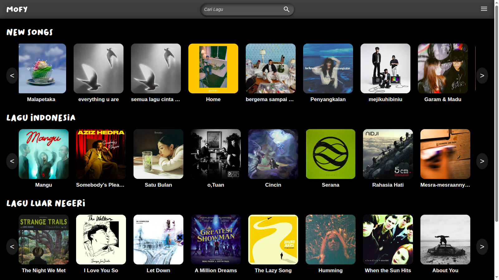

<h1 align="center">🎧 My Player Music - MOFY 🎶</h1>

<p align="center">
  
</p>

## 🌟 Fitur

- 🎵 Putar lagu dari berbagai kategori
- 🔍 Cari lagu favorit
- 🌓 Tema gelap estetik
- 🎨 UI smooth dan interaktif
- ⚡ Keyboard shortcut (play/pause/next)

## 🖼️ Preview

 <!-- Ganti sesuai path kalau upload langsung -->

## 🚀 Cara Menjalankan

```bash
git clone https://github.com/iruzz/my-player-music.git
cd my-player-music
npm install
npm run dev

## ✨ Authors

<p align="left">
  <a href="https://github.com/iruzz" target="_blank">
    
    <br />
    <sub><b>iruzz</b></sub>
  </a>
  &nbsp;&nbsp;&nbsp;
  <a href="https://github.com/namaAuthor2" target="_blank">
    
    <br />
    <sub><b>namaAuthor2</b></sub>
  </a>
</p>

